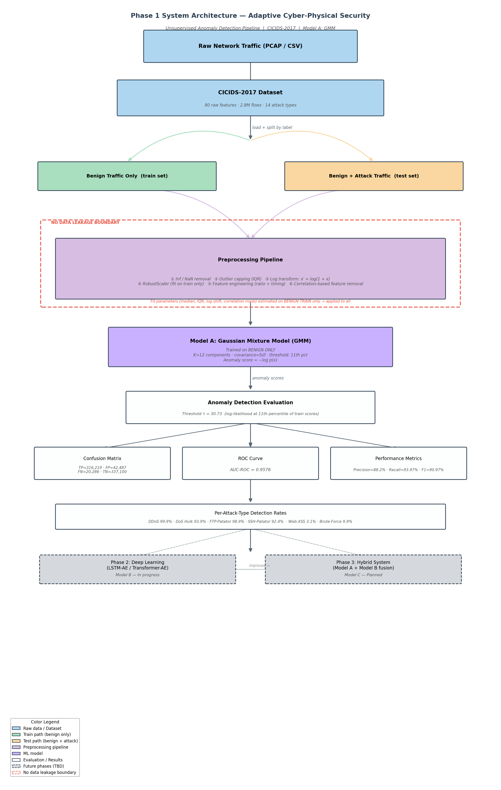
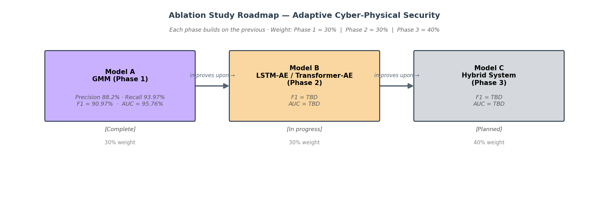

# Adaptive Cyber-Physical Security — Anomaly-Based Intrusion Detection

[]()
[]()
[]()

## Project Overview

Modern industrial and cyber-physical systems face an ever-growing threat landscape in which
adversaries increasingly exploit zero-day vulnerabilities — attack vectors unseen by
signature-based intrusion detection systems (IDS). Traditional rule-based and supervised
approaches require labeled attack examples to train on; in practice, novel malware and
advanced persistent threats arrive faster than labels can be curated. This project addresses
that gap by building a **three-phase anomaly-based IDS** that learns only from normal benign
traffic and flags any deviation as a potential intrusion.

Our methodology follows a rigorous academic ablation roadmap. Phase 1 establishes a classical
machine learning baseline (Model A) evaluated on the widely-used CICIDS-2017 benchmark.
Phase 2 will introduce a deep sequential representation learner (Model B), and Phase 3 will
combine both into a hybrid system (Model C). The CICIDS-2017 dataset provides 2.8 million
labeled network flows spanning 14 distinct attack categories, allowing fine-grained analysis
of per-attack detection rates and systematic identification of failure modes that motivate
the subsequent deep-learning phase.

## Team

| Name | Role |
|------|------|
| Yash L. | EDA, preprocessing pipeline, report |
| Rishabh | Model training, evaluation, architecture |

## Repository Structure

```
adaptive-cyber-security/
├── README.md
├── requirements.txt
├── .gitignore
│
├── data/
│   └── README.md                  # Download instructions for CICIDS-2017
│
├── notebooks/
│   ├── 01_EDA.ipynb               # Stage 1: Exploratory Data Analysis
│   ├── 02_Preprocessing.ipynb     # Stage 2: Feature engineering & scaling
│   └── 03_Model_Training.ipynb    # Stage 3: Model A training & evaluation
│
├── src/
│   ├── __init__.py
│   ├── features.py                # FeatureEngineer class
│   ├── models.py                  # AnomalyDetector base + IF / OCSVM / GMM
│   └── evaluate.py                # Evaluation functions & plot generators
│
├── models/
│   ├── model_a_gmm.pkl            # Saved Model A (GMM)
│   └── model_a_threshold.npy     # Decision threshold τ
│
├── outputs/
│   ├── eda/                       # EDA plots (10 figures)
│   ├── preprocessing/             # Preprocessing plots + X_train/X_test arrays
│   ├── models/                    # Model analysis plots
│   ├── architecture_diagram_phase1.png
│   ├── architecture_diagram_phase1.pdf
│   └── ablation_overview.png
│
├── results/
│   ├── model_a_metrics.csv
│   ├── if_gridsearch.csv
│   ├── ocsvm_gridsearch.csv
│   └── gmm_covtype.csv
│
├── report/
│   └── phase1_report.tex          # IEEE conference LaTeX report
│
└── presentation/
    └── phase1_presentation.pdf           # 10-slide
```

## Phase 1 Results — Model A (Gaussian Mixture Model)

### Main Results Table

| Model | Precision | Recall | F1-Score | AUC-ROC |
|-------|-----------|--------|----------|---------|
| Statistical Baseline | 50.0% | 100.0% | 66.7% | 64.8% |
| Isolation Forest | 75.4% | 51.8% | 61.4% | 80.3% |
| One-Class SVM | 76.8% | 74.9% | 75.9% | 87.2% |
| **GMM (Model A)** | **88.2%** | **93.97%** | **90.97%** | **95.76%** |

Model A hyperparameters: `n_components=12`, `covariance_type='full'`, `threshold_percentile=11`

### Per-Attack-Type Detection Rates (Model A — GMM)

| Attack Type | Total Flows | Detected | Detection Rate |
|-------------|-------------|----------|----------------|
| DDoS | 128,016 | 127,933 | 99.9% |
| FTP-Patator | 5,933 | 5,867 | 98.9% |
| DoS Slowhttptest | 5,228 | ~5,200 | ~99.5% |
| DoS slowloris | 5,385 | 3,734 | 69.3% |
| SSH-Patator | 3,219 | 2,974 | 92.4% |
| DoS Hulk | 172,849 | 162,452 | 93.9% |
| DoS GoldenEye | 10,286 | 5,632 | 54.8% |
| PortScan | 1,958 | 1,422 | 72.6% |
| Bot | 1,441 | 792 | 55.0% |
| Web Attack - Brute Force | 1,470 | 146 | 9.9% |
| Web Attack - XSS | 652 | 20 | 3.1% |

### Architecture Diagram



### Ablation Roadmap



| Model | Phase | Method | F1-Score | AUC-ROC | Status |
|-------|-------|--------|----------|---------|--------|
| Model A | Phase 1 | GMM (unsupervised ML) | **90.97%** | **95.76%** | Complete |
| Model B | Phase 2 | LSTM-AE / Transformer-AE | TBD | TBD | In progress |
| Model C | Phase 3 | Hybrid (A + B) | TBD | TBD | Planned |

## Quick Start

```bash
git clone https://github.com/Yash121l/sem6-aml-dl-project.git
cd sem6-aml-dl-project
pip install -r requirements.txt

# Download CICIDS-2017 from https://www.unb.ca/cic/datasets/ids-2017.html
# Place the CSV files in data/raw/ (see data/README.md for details)

jupyter notebook notebooks/01_EDA.ipynb
```

## Notebooks (run in order)

| Notebook | Description | Key Outputs |
|----------|-------------|-------------|
| `01_EDA.ipynb` | Dataset loading, 10 EDA plots, class distribution analysis | `outputs/eda/` |
| `02_Preprocessing.ipynb` | Inf/NaN removal, IQR capping, log transform, RobustScaler, feature engineering, correlation-based removal | `outputs/preprocessing/` |
| `03_Model_Training.ipynb` | Isolation Forest, OCSVM, GMM training; grid search; failure analysis; Model A selection | `outputs/models/`, `models/` |

## Key Design Decisions

- **Train on benign only**: Any supervised model trained on attack labels can only detect
  attacks it has already seen. By learning only the distribution of normal traffic (one-class
  learning), our system detects any deviation — including zero-day attacks — without requiring
  a single malicious example during training.
- **Gaussian Mixture Model selected as Model A**: GMM achieved F1=90.97% vs 75.9% (OCSVM)
  and 61.4% (Isolation Forest). The full-covariance GMM can model correlated feature clusters
  that correspond to different benign traffic regimes (interactive, bulk transfer, DNS, etc.),
  making it more expressive than axis-aligned methods.
- **RobustScaler over StandardScaler**: Network flow features contain extreme outliers from
  flood attacks. RobustScaler uses median and IQR, making it robust to these outliers.
  Crucially, it is fit only on benign training data to prevent test-set leakage.
- **Log transform `x' = log(1 + x)`**: Flow byte/packet counts span 6+ orders of magnitude.
  Log-transforming skewed features compresses the dynamic range and prevents large flows from
  dominating the covariance matrix in GMM fitting.

## Evaluation Methodology

The correct anomaly detection split is:
1. **Train**: Benign flows only (1,518,344 flows). The model learns the normal distribution.
2. **Test**: Benign + all attack flows (~716,000 flows). Labels used only for evaluation.
3. **Preprocessing fit**: All scaler/transformer parameters (median, IQR, log shifts) are
   estimated from the training benign set and applied without re-fitting to the test set.
   This faithfully simulates deployment where the model sees only normal data during training.

This is fundamentally different from supervised classification splits. The model is never
exposed to attack examples during training — the positive class exists only in the test set
to evaluate detection performance.

## Phase Roadmap

| Phase | Description | Status | Weight |
|-------|-------------|--------|--------|
| Phase 1 | ML baseline — Model A (GMM) | **Complete** | 30% |
| Phase 2 | Deep Learning — Model B (LSTM-AE / Transformer-AE) | In progress | 30% |
| Phase 3 | Hybrid system — Model C (A + B ensemble) | Planned | 40% |

## References

1. Liu, F. T., Ting, K. M., & Zhou, Z.-H. (2008). Isolation Forest. *ICDM 2008*.
2. Schölkopf, B., Platt, J., Shawe-Taylor, J., Smola, A. J., & Williamson, R. C. (2001).
   Estimating the support of a high-dimensional distribution. *Neural Computation, 13*(7).
3. Bishop, C. M. (2006). *Pattern Recognition and Machine Learning*. Springer.
4. Sharafaldin, I., Lashkari, A. H., & Ghorbani, A. A. (2018). Toward Generating a New
   Intrusion Detection Dataset and Intrusion Traffic Characterization. *ICISSP 2018*.
5. Mirsky, Y., Doitshman, T., Elovici, Y., & Shabtai, A. (2018). Kitsune: An Ensemble of
   Autoencoders for Online Network Intrusion Detection. *NDSS 2018*.
